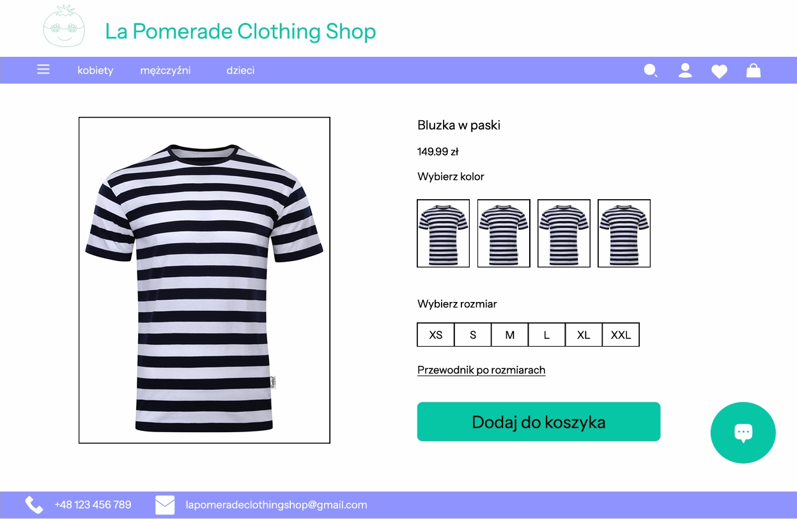
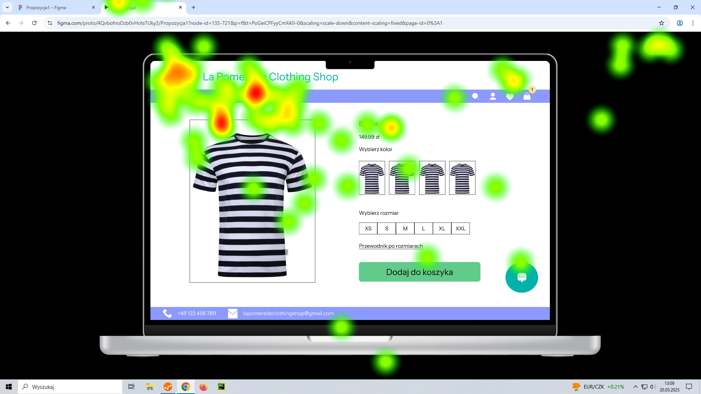
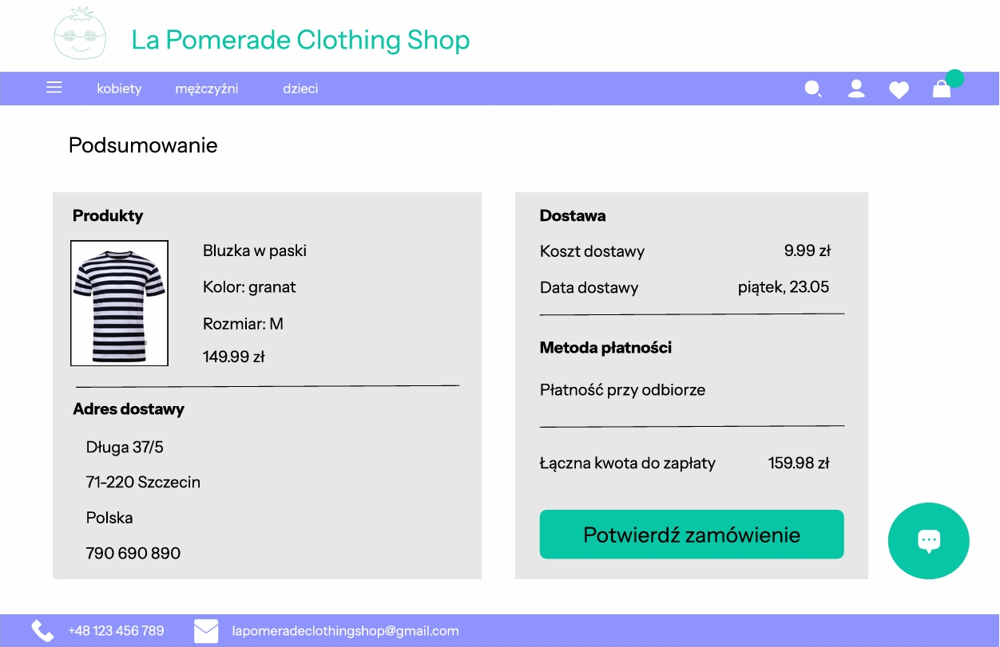
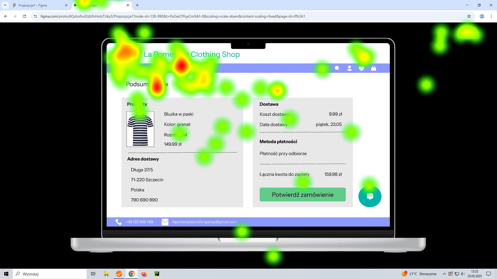
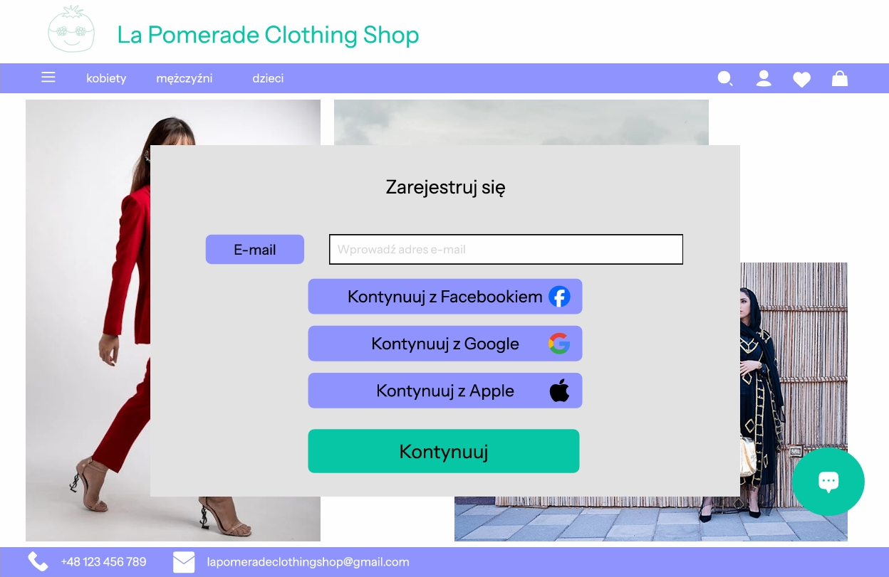
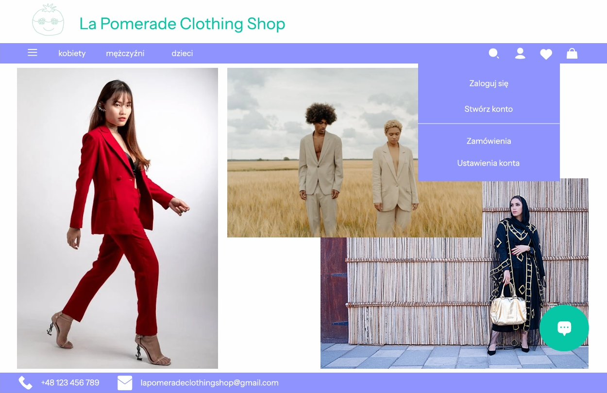
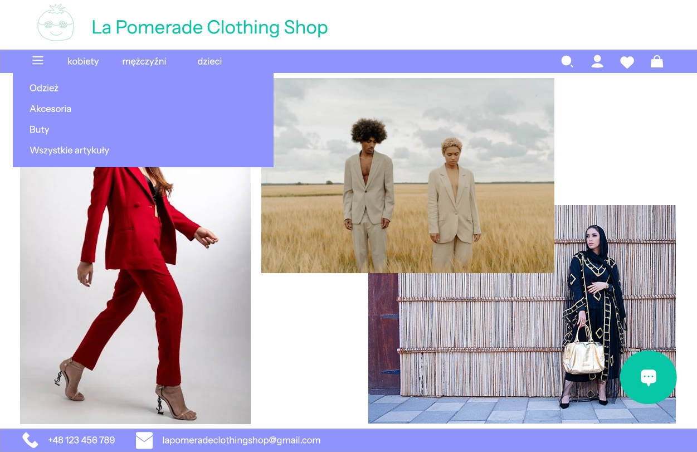

# Projekt w ramach zajęć z przedmiotu Projektowanie zorientowane na użytkownika (UCD)
na Zachodniopomorskim Uniwersytecie Technologicznym w roku akademickim 2024/2025.

## Autorzy
- Martyna Kowieska
- Marek Lewandowski
- Stanisław Błaszczyk

## Link do makiet wykonanych w Figmie
https://www.figma.com/files/team/1481273283414146822/project/350601661?fuid=1481273281657506644

## Wygląd strony internetowej
1. Strona główna

2. Wybór produktu

Eye Tracking Test

3. Koszyk

Eye Tracking Test

4. Rejestracja

5. Pasek konta

6. Pasek artykułów

